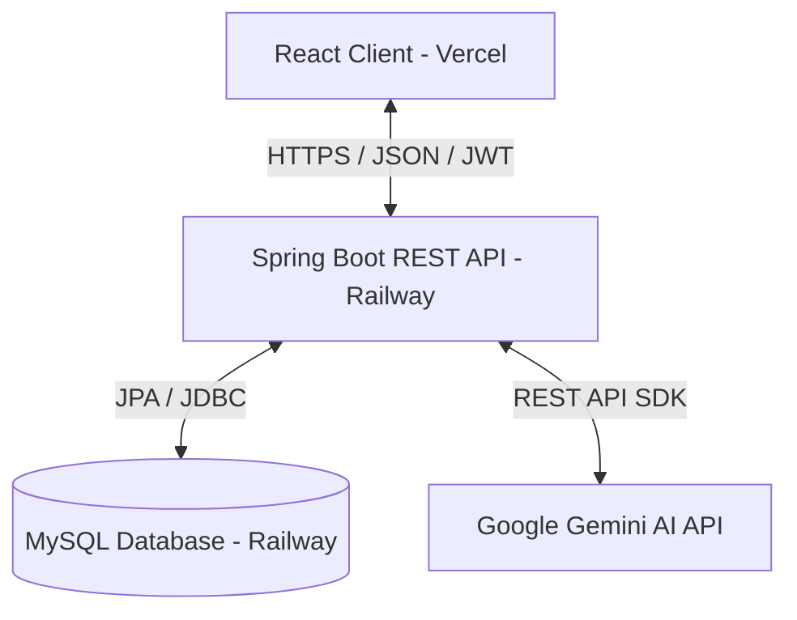

# 💳 WalletIQ - Smart Personal Finance & Expense Management

[](https://www.oracle.com/java/)
[](https://spring.io/projects/spring-boot)
[](https://react.dev/)
[](https://vite.dev/)
[](https://www.mysql.com/)
[](https://railway.app/)
[](https://vercel.com/)
[](https://opensource.org/licenses/MIT)

**WalletIQ** is a premium, next-generation personal finance tracker and expense management platform designed for users who want complete visibility and control over their finances. Combining a robust Java Spring Boot backend with a sleek, responsive React frontend, WalletIQ delivers an enterprise-grade SaaS experience for tracking budgets, expenses, and asset accounts in real time.

---

## 🚀 Key Features

*   **🔒 Secure Authentication**: State-of-the-art JWT authentication, rate limiting, and password hashing protect user data.
*   **📊 Dynamic Dashboard**: View key statistics including cash flow summaries, spending breakdowns by category, budget progress bars, and recent transactions.
*   **💸 Expense & Transaction CRUD**: Seamlessly record, modify, and delete transactions with support for descriptions, payment accounts, and categories.
*   **🏷️ Category & Budget Tracking**: Organize your spendings with customizable categories and define budget limits with active warning alerts.
*   **💳 Account Management**: Keep track of multiple payment methods, credit cards, and bank account balances dynamically.
*   **🤖 AI Finance Assistant**: Leverage an integrated Gemini AI Assistant to ask questions about your budget, ask for saving tips, or parse financial advice.
*   **📱 Glassmorphic UI**: Beautiful, fully responsive layout built with modern typography, smooth animations, and dual light/dark mode support.

---

## 🛠️ Technology Stack

| Component | Technology | Description |
| :--- | :--- | :--- |
| **Backend Core** | Java 21 / Spring Boot 3.3 | Enterprise REST API and business logic framework |
| **Security** | Spring Security / JWT / BCrypt | User authentication and rate-limiting filters |
| **Persistence** | Spring Data JPA / Hibernate | Object-Relational Mapping (ORM) layer |
| **Database** | MySQL | Production relational database |
| **Frontend Core** | React 18 / Vite 8 | Fast, modern client-side library and builder |
| **State & Forms** | React Hook Form / Zod | Secure form handling and client-side data validation |
| **Styling** | Vanilla CSS / TailwindCSS | Premium custom aesthetics and layouts |
| **Animations** | Framer Motion | Fluid micro-interactions and transitions |
| **Icons** | Lucide React | Modern financial and UI icon packs |

---

## 🏛️ Project Architecture



---

## 📁 Repository Structure

```text
├── backend/                     # Spring Boot Application Root
│   ├── src/main/java/           # Java Source Code
│   │   └── com/expensetracker/  # Package Root (Controllers, Entities, DTOs, Security)
│   ├── src/main/resources/      # Application Configuration (application.yml, DB seeders)
│   └── pom.xml                  # Maven Dependency Config
│
├── frontend/                    # React Client Application Root
│   ├── src/                     # React Components, Pages, State, and API Services
│   │   ├── components/          # Reusable layouts (Navbar, Sidebar, Cards)
│   │   ├── pages/               # Routing views (Login, Dashboard, Transactions, Settings)
│   │   └── api/                 # Axios clients and request interceptors
│   ├── public/                  # Static assets (favicons, SVG icons)
│   ├── vercel.json              # Vercel SPA Routing Configuration
│   └── package.json             # NPM dependencies and build commands
│
├── Dockerfile                   # Monorepo build script for Railway
├── railway.json                 # Railway service deployment configuration
└── README.md                    # Project Documentation
```

---

## ⚙️ Environment Variables

### Backend Configuration (`.env`)
Create a `.env` file inside the `backend` directory (or configure them as environment variables on Railway):

| Variable Name | Purpose | Example / Placeholder |
| :--- | :--- | :--- |
| `DB_HOST` | Database host hostname | `localhost` or `mysql-service` |
| `DB_PORT` | Database port number | `3306` |
| `DB_NAME` | Database schema name | `expensetracker` |
| `DB_USER` | Database connection username | `root` |
| `DB_PASSWORD` | Database connection password | *(Keep secure)* |
| `JWT_SECRET` | Secret key for signing authorization tokens | *(Use a cryptographically secure 512-bit string)* |
| `GEMINI_API_KEY` | Gemini AI credentials for the financial assistant | *(Retrieve from Google AI Studio)* |

### Frontend Configuration (`frontend/.env`)
Create a `.env` file inside the `frontend` directory (or configure on Vercel):

| Variable Name | Purpose | Value |
| :--- | :--- | :--- |
| `VITE_API_BASE_URL` | Endpoint targeting the backend API | `https://your-backend-service.up.railway.app` |

---

## 💻 Local Setup & Installation

### Prerequisites
- JDK 21
- Maven 3.9+
- Node.js 18+ & NPM
- MySQL 8.x

### 1. Database Setup
Create a MySQL database named `expensetracker`:
```sql
CREATE DATABASE expensetracker;
```

### 2. Backend Installation
1. Navigate to the `backend/` directory.
2. Build the project using Maven:
   ```bash
   mvn clean install
   ```
3. Run the Spring Boot application:
   ```bash
   mvn spring-boot:run
   ```
   *The server will start on port `8080` (or the port defined in your environment).*

### 3. Frontend Installation
1. Navigate to the `frontend/` directory.
2. Install the required Node packages:
   ```bash
   npm install
   ```
3. Run the development server:
   ```bash
   npm run dev
   ```
   *Open `http://localhost:5173` in your browser to interact with the application.*

---

## 🌐 API Overview

All backend endpoints are prefixed with `/api`. Typical responses return standard HTTP statuses and JSON payload structures.

*   `POST /api/auth/register` - Create a new user profile
*   `POST /api/auth/login` - Authenticate credentials and retrieve JWT
*   `GET /api/auth/me` - Retrieve current logged-in user profile details
*   `GET /api/transactions` - Fetch user's transaction records
*   `POST /api/transactions` - Add a new transaction record
*   `GET /api/accounts` - Retrieve all credit, debit, or bank accounts
*   `GET /api/budgets` - Check active budget goals and limit alerts
*   `POST /api/ai/chat` - Query Gemini AI Financial Assistant

---

## ☁️ Deployment

### Railway (Backend)
WalletIQ is configured to compile from the monorepo root using Docker. Ensure the service has a linked MySQL database, correct env variables set, and it will deploy automatically on push.
*   Builder: **DOCKERFILE**
*   Root Directory: `/` (using the root `Dockerfile` and `railway.json` configurations)

### Vercel (Frontend)
Host the React app on Vercel:
*   Framework Preset: `Vite`
*   Root Directory: `frontend`
*   Build Command: `npm run build`
*   Output Directory: `dist`

---

## 🔮 Future Enhancements
*   [ ] Multi-currency support and real-time exchange rate conversions.
*   [ ] Direct PDF/Image receipt uploading with OCR data extracting.
*   [ ] Interactive spending charts and predictive analytics.
*   [ ] Export reports in CSV, PDF, or Excel sheets.

---

## 🤝 Contribution Guidelines
Contributions are welcome! Please follow these steps:
1. Fork this repository.
2. Create a new branch: `git checkout -b feature/my-new-feature`
3. Commit your changes: `git commit -m 'feat: add some feature'`
4. Push to the branch: `git push origin feature/my-new-feature`
5. Submit a Pull Request.

---

## 📄 License
This project is licensed under the **MIT License** - see the LICENSE file for details.

---

## 👤 Author
*   **P. Chandru** - *Lead Developer* - [ChandruDon07](https://github.com/ChandruDon07)
